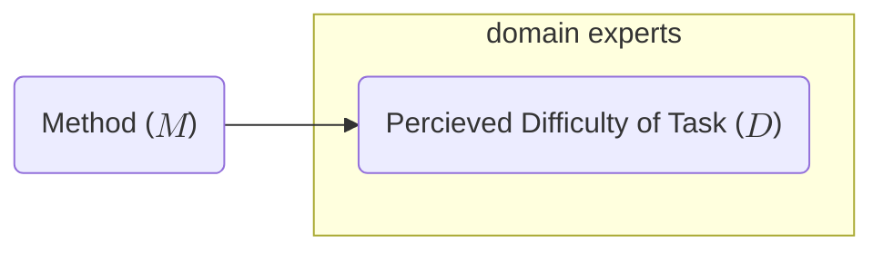
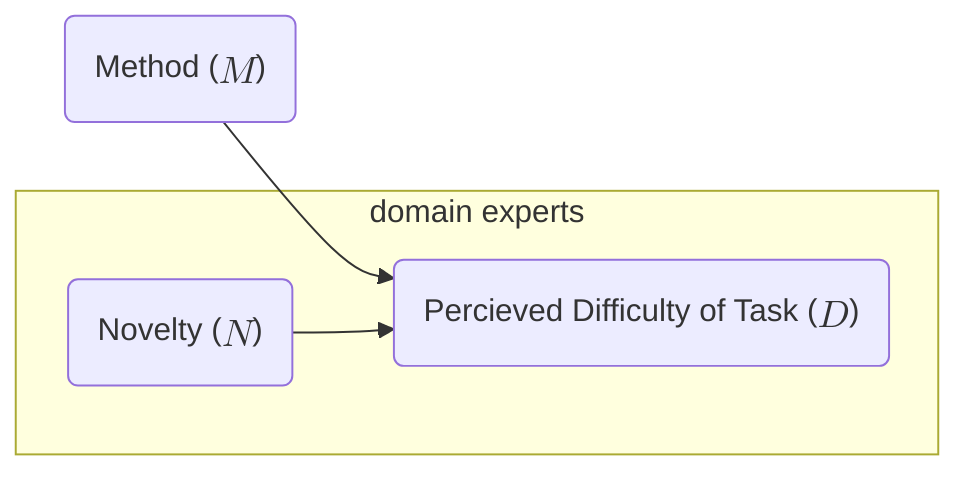
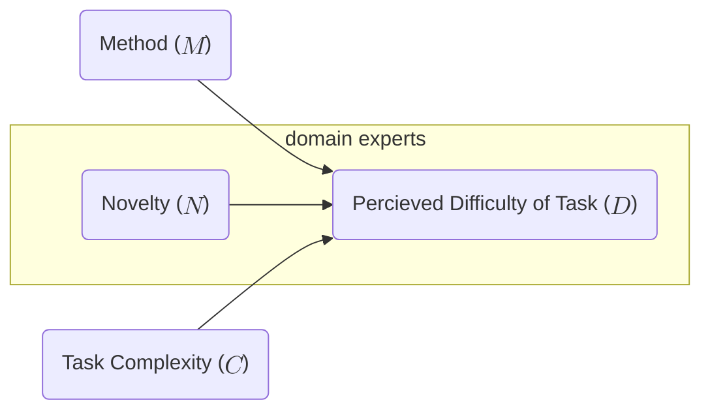
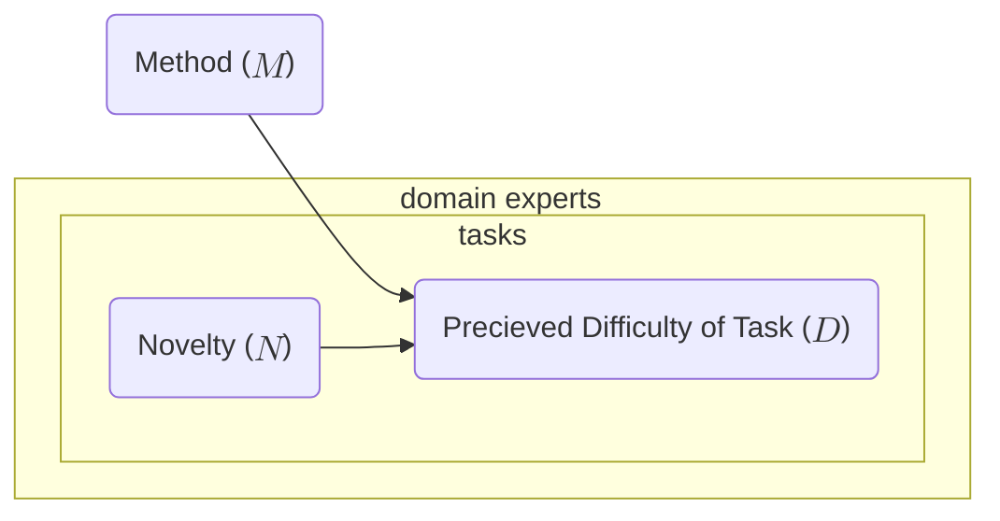

In [my previous post](20250916_jupyter_dsls.md), I asserted:

> ...learning a new formal language can itself contribute to the difficulty of encoding an experiment.

This statement was based on assumptions, intuitions, and folk wisdom. I started digging into the DSL usability research to see if I could find explicit support for this statement. This blog post is about what I found. 

<!-- more -->

Suppose I have a DSL for a task that was previously manual. I want to conduct a user study. I decide to use some previously validated instrument to measure differences in perceived difficulty of encoding/performing a task ($D$), and vary the method used to code the task ($M=\text{DSL}$ vs. $M=\text{manual}$). Suppose there is no variability in task difficulty for now: the specific task is fixed for the duration of the study, i.e., is controlled.

Ideally, I'd like to just measure the effect of $M$ on $D$; we are going to abuse [plate notation](https://en.wikipedia.org/wiki/Plate_notation)[^1] a bit and say that the following graph denotes "method has an effect on percieved difficulty of performing a specific task for the population of experts in the domain of that task:"

The first obvious problem is that $D$ is a mixture of some "inherent" difference due to $M$ and the novelty of the method/context/context/environment/situation ($N$). We have not included $N$ in our model; let's do so now:

Conducting a na&iuml;ve study results in $(D \vert M=\text{manual}, N = 0)$ vs. $(D \vert M=\text{DSL}, N \gg 0)$. This is why we have the study participants perform a training task first: it's an attempt to lower $N$ as much as possible, i.e., to control for novelty.

Training tasks are obviously not unique to DSL research; however, there are other tactics for reducing novelty that _are_ unique to programming systems. For example, it seems obvious that IDE features like syntax highlighting and autocomplete that are part of a "normal" programming environment would reduce the value of $N$; so would integrating the DSL into the target users' existing toolchain/workflow.

If we allow the task to vary, then our model needs to include another potential cause for $D$:

The details of how we represent $C$ matter: whatever [scale](https://en.wikipedia.org/wiki/Level_of_measurement) we use, it contains a baked-in assumption that for any two tasks $t_1$ and $t_2$ where $t_1\not=t_2$, but $C(t_1)=C(t_2)$, we can treat $t_1\equiv t_2$. This  is a big assumption! What if there are qualitative differences between tasks not captured by the complexity metric that influence $D$? In that case, we may want to use a different variable to capture $C$, perhaps a binary feature vector, or maybe we want to split $C$ into a collection of distinct variables. Maybe task complexity isn't objective but subjective, in which case we would want to include in our domain experts plate. Maybe we want to forego $C$ altogether and instead treat tasks as a population we need to sample over, e.g.,

I have plenty more to say and would love to iterate on the design of this hypothetical user study, but I am going to stop here because the above diagram _feels_ like something that should already be established in the literature. Like a lot of folk wisdom, it's suggested, implied, assumed, and (I think!) generally accepted, but so far I have not found any explicit validation of the above schema. That doesn't mean it isn't out there; it means that (a) there isn't a single canonical paper accepted by the community as evidence and (b) where the evidence does exist, it's embedded in work that primarily addresses some other research question.

So, for now, I am putting together [a DSL usability study reading list](https://docs.google.com/spreadsheets/d/15m-mItC7kyjtI9u3MhhnFmlKtI51GWuSLPrF5keNITk/edit?usp=sharing) of works that I think touch on this fundamental problem in meaningful ways. I consider [Profiling Programming Language Learning](https://dl.acm.org/doi/pdf/10.1145/3649812) and [PLIERS: A Process that Integrates User-Centered Methods into Programming Language Design](https://dl.acm.org/doi/pdf/10.1145/3452379) seed papers and have gotten recommendations from [Andrew McNutt](https://www.mcnutt.in/), [Shriram Krishnamurthi](https://cs.brown.edu/~sk/), and [Lindsey Kuper](https://users.soe.ucsc.edu/~lkuper/). Please feel free to add to this (or use it yourself!). I look forward to writing a follow up post on what I find. :)

[^1]: While the plate notation here looks similar to the output that Helical produces for HyPL code, the specific graphs are more precise than those that Helical can currently produce. For example, only $D$ is embedded in the domain experts plate. Helical's current implementation would place both $M$ and $D$ in this plate. 

_Cross-posted from the [Helical project blog](https://explcause.github.io)._
