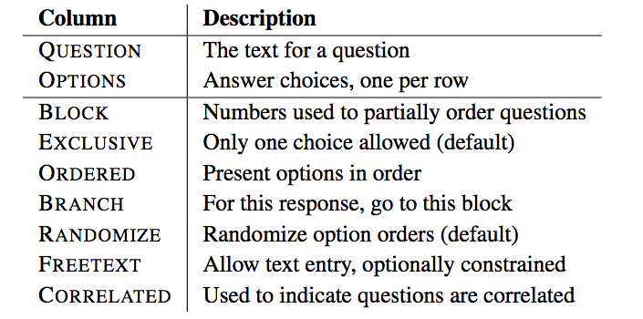
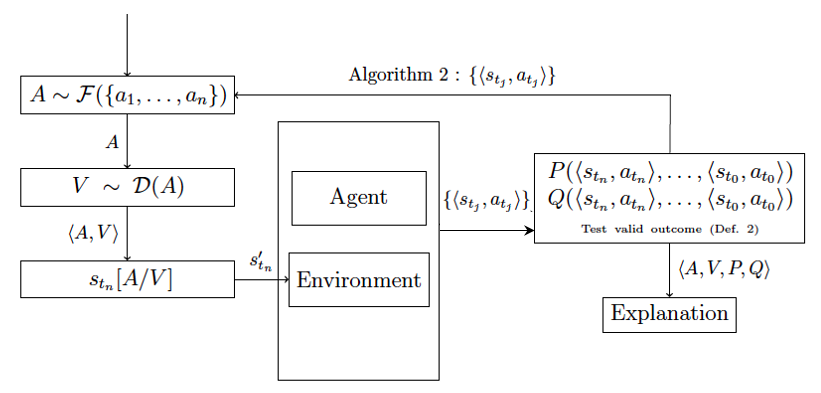
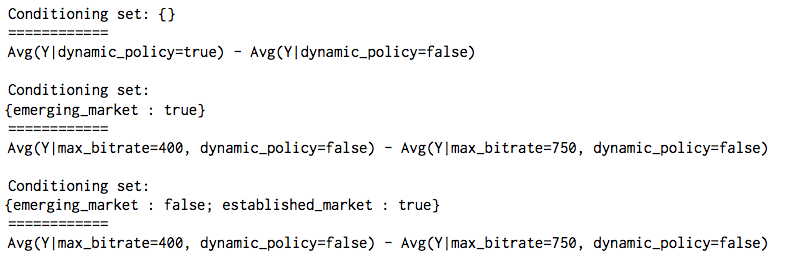

Everyone should have an elevator pitch about their research. When we start out, that pitch is very focused on a particular project, problem, or technique. As time passes, we form a more expansive _research vision_ that can encompass new domains, related problems, and complementary techniques, but still ties everything together in a coherent philosophy, with a long-term goal. My pitch is: _programming languages (PL) and software engineering (SE) form the methodological foundation for next-generation advancements in data-driven scientific inquiry_. Just as scientific instruments made new experiments and discoveries possible, so too will new programming languages, systems, frameworks, and platforms.

<!-- more -->

Therefore, my perspective is to work on the fundamental tooling that allows us to answer a variety of research questions. I'm guided by the following questions:[^1]

* [What are the core abstractions of a problem or domain and how do they combine?](#abstractions) (<u title="Programming Languages">PL</u>)
* [How do we encode these abstractions in programs or software systems?](#language-design-and-system-building) (<u title="Programming Languages">PL</u>/Systems)
* [Once encoded, how do we know the system is correct? What properties should it have?](#correctness) (<u title="Programming Languages">PL</u>/<u title="Software Engineering">SE</u>/Security/Privacy/Fairness/Statistics)
* [Once encoded, how do we get people to use our system (and use it correctly!)?](#people-centric-evaluation) (<u title="Software Engineering">SE</u>/<u title="Human-Computer Interaction">HCI</u>/Security)
* [Once we have a system, what questions can we answer now that we couldn't answer before?](#applications) (<u title="Data Science">DS</u>, <u title="Machine Learning">ML</u>, <u title="Computational Social Science">CSS</u>, etc.) 

## Abstractions

Throughout my research career, I have been interested in developing [_domain-specific languages_](https://en.wikipedia.org/wiki/Domain-specific_language) (DSLs) for tasks when appropriate. Some common DSLs that people may know are <u title="Structured Query Language, a specification for querying databases">SQL</u>, <u title="Cascading Stylesheets, a specification for website layout">CSS</u>, and even [spreadsheets](https://www.youtube.com/watch?v=TMIBfzSqguQ) like Excel! What differentiates DSLs from so-called "general-purpose programming languages" is that their design is _tailored to a specific task_: they may certain things much easier to do than others. We refer to the set of things that are easy to do as the base set of _abstractions_, and the language restricts or enables how those abstractions may combine. 

A critical feature of language design is recognizing whether it is germane to the problem in the first place! Not all problems or domains necessitate a new language. Instead, in my research, I work to understand the problem or domain first, and then identify and encode (typically in consultation with a domain expert) language abstractions and rules for combining those abstractions. Sometimes this process of formalization can reveal interesting properties about the domain not previously considered. Sometimes these properties are a byproduct of moving a perviously manual or offline task to an encoded, automated one. 

{:width="70%"}

For an example of this approach, see my [SurveyMan](https://surveyman.emmatosch.com) work.

_While the SurveyMan project has been on hold for several years, I am looking to work with students on some related work/research questions in both programming languages (specifically related to blocks languages) and computational social science (specifically related to crowdsourcing). I am particularly interested in students who would like to address security questions (related to adversarial behavior during data collection) and privacy questions (related to protecting participants' information). Please reach out if you are interested!_

## Language Design and System Building
Once we have identified the core set of abstractions and how they combine, my work usually involves implementing them in an actual system! This step of the research often involves some iteration with the [abstraction design process](#abstractions), and is coding-heavy. One of the concrete benefits to students who work with me is that they have the opportunity to hone their programming skills while also doing research.[^2] For larger systems, the software architecture can become a research contribution, especially if that software architecture generalizes to related problems. 

{:width="70%"}

This is an example of ongoing work on the software architecture for explanation systems for autonomous agents.

_This is ongoing on work that includes opportunities for students interested in probabilistic programming languages. Please reach out if you are interested!_

## Correctness
The advantage of encoding abstractions is that they facilitate proving properties about programs. We can use the base abstractions and the rules for how they combine to show inductively that properties of interest hold. Traditionally this has meant devising a _type system_, which categorizes pieces of programs into sets, and showing that the system is _sound_, according to some predefined notion of "soundness." Students familiar with types in programming languages may recognize _type safety_ as a kind of soundness, where the procedure that categorizes these pieces of programs never "gets stuck" and always arrives at the same answer. 

There are many properties that can be proven about programs, other than type safety. For example, _static taint analysis_ uses information flow to prove that private data does not leak, while _type state_ provides the abstractions necessary to reason about interactions between a program and the persistent mutable state of the executing machine (e.g., a file is properly closed). Both of these examples are about properties not normally associated with type inference, but address the correctness of programs nonetheless.

The [PLAID Lab](https://plaid.w3.uvm.edu/) has expertise in proving properties of programs, in the domains of type safety, security, privacy, and fairness. My future collaborations will reflect the expertise present here at UVM.
 

## People-Centric Evaluation
During the design phase, I work with domain experts to understand what tools potential users prefer. While this process of including users in the design loop has been informal, I look forward to working with collaborators and students who are interested in taking a more human-factors approach to the evaluation of new systems. I am particularly interested in better understanding the usability of the language, tools, and systems I design.

For example, the output of my [PlanAlyzer](https://arxiv.org/pdf/1909.13649.pdf) [static analysis tool](https://github.com/KDL-umass/PlanAlyzer) is either the above "pretty-printed" text, or <u title="comma-separated values, a file format suitable for uploading to a spreadsheet or database">csvs</u> that can be loaded into a database. The above notation uses the conventions of experimentalists, but this output does not scale, and may not be understood by non-experts.

_I am particularly interested in collaborating with folks who study, or are interested in studying, how to better present large volumes of information to users, especially when users must make decisions in the presence of these data._

## Applications
Finally, since I am interested in designing better _platforms_ for facilitating basic research, I enjoy working with folks who have interest or expertise in specific application areas. In a way, my collaborators could be seen as "clients" of my software, except that there is the goal of discovering novel problems at the intersection of software and their domains, rather than simply delivering solutions. This means that my collaborations are cooperative.

<!-- [^1]: While I am sure many others have made this observeration, I need to thank [Abe Handler](https://www.abehandler.com/) and [John Foley](https://jjfoley.me/) specifically, for pointing out to me that we have TensorFlow and related prior projects to thank for the exponential increase in deep learning research! -->

[^1]: This very question-first approach to research is deeply influenced by one of my PhD supervisors, [Dr. David Jensen](https://cs.umass.edu/~jensen), who has always been an exemplar of how to view computing as _science_. 
[^2]: Often students expect research to involve more programming; while it can, students may go for long periods of time without practicing. This can become a problem if, years into a PhD program, you realize you need to write software to do your research, but lack the experience or skills to do it yourself. 