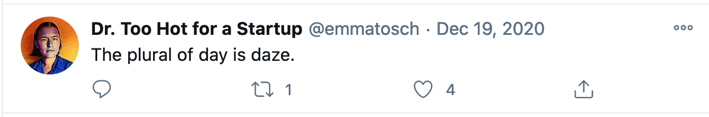

I've been on and off Twitter for over
a decade, and have recently decided to deactivate my personal account ([@emmatosch](https://twitter.com/emmatosch)) and transition 
over to using my professional account ([@toschemma](https://twitter.com/toschemma)) exclusively, effective 1/12/20. This post walks through 
my rationale; it's less social media [quit-lit](https://www.theatlantic.com/entertainment/archive/2015/09/dont-quit-your-day-job/404671/) and more of a reflection of how I need to update how I see me to be more in line with how others will see me
in my new job.

<!-- more -->

## Usage over time
Twitter was only three years old when I'd joined, and I mostly knew marketing people on it, which meant my feed
was qualitatively quite different from what it is now. I've gone through periods where my feed was mostly about political news, 
to periods where it was entirely standup comedians vetting new materials, to it being entirely dominated by people from tech. 
A few years ago I came to realize that *Twitter was the best place to learn about post-doctorate positions,* and began using it
more regularly, following an assortment of academics I might want to work with. 

Around the time I was adding more academics to my feed, I experienced some challenges in my PhD. I laid low for a while, but 
when I felt ready to start getting out there again, I decided to use Twitter in a very specific way: _to be seen_, and the 
strategy I took to be seen was to _show my personality_, no matter how weird it may be, and to 
_not take anything that seriously_. For exanple, this was one of my last tweets; the only context necessary is the pandemic:

## Microblogging vs. Blogging
Now, I feel I should point out that I did have an internet footprint before I started
engaging more on Twitter.
 I had been blogging about [my research (as a PhD student)](https://blog.emmatosch.com) for a while at that time. 
I used blogging to try out ideas, work through concepts, and generally as a research notebook, and for technical documentation.
Critically, I used blogging to just get myself to write, _even if the content containted inaccuracies_. 
I assumed no one was really reading my blog, which is mostly true!

Blogging had a very specific function for 
me, and I used Twitter quite differently. I often felt uncomfortable, out of place, or socially anxious at conferences and 
other in-person venues where people talk about their research and become known. As someone who came to computing later,
it took time to learn the social norms of the field, and that learning process could be deeply uncomfortable. 
Twitter, on the other 
hand, gave me the chance to re-engage with the community in what felt like a very low-stakes way. Interactions are public, 
and expectations about the topics you weigh in on are invariably lower -- because Twitter is a very open platform, anyone 
can express any thought about any topic! To be concrete: if a group of professors are talking about their research, community
policies, teaching, etc. at a conference reception, you don't know if you are _actually_ welcomed to join. However, if these 
conversations happen on Twitter, everyone has the expectation that some rando might pop in. 

## Curating my Twitter persona
So, back to how I used Twitter: like I said, I decided _to be seen_. 
However, popping into existing conversations was 
challenging because I had been out of the loop for some time. Instead, I decided I would just try to tweet funny/absurd/silly 
things about life, pop culture, computing more broadly, etc. As far as I can tell, this approach actually worked! 

This might sound overly sentimental, but I have come to cherish
these interactions over the years: they feel like some of the most human professional interactions I've had. Twitter can be 
_fun_. However, as I've transitioned from being a student to being a faculty member, I've started to think about things 
differently. 

## Becoming a more public figure
I've been thinking a lot about what it means to reconcile the abrupt change in my public image 
(i.e., graduate student to tenure-track faculty) with how I see myself. One thought I keep coming back to is that, even though I 
still have much to do and much to prove, my new job carries institutional authority and structural power that I need
to be mindful of. 

The specific question I've been mulling over is: what do I owe current and future PhD students, and how can I ensure
that my public presence on fora such as Twitter reflects that? I think the answer to the first half of that question is: 
I owe it to students to work towards being the kind of professor we all wish we had -- someone wiser and more centered
than anyone of us actually are. For the second half of the question, I've come to realize that that means being mindful
about the image I put out into the world.
I worry that my Twitter persona -- 
snarky weird "kid" mumbling under her breath in the back of the class -- will increasingly alienate more junior people who 
only see me as someone with intitutional power, not as someone who struggled to get where she is, who at one time had 
more in common with struggling students, but who has rapidly lost perpsective once she "made it." 
No matter how hard being a junior faculty member may be personally, it is still a position of privilege. 

Maybe more talented users of social media can make the transition from being seen as someone who fights The Man to
being seen as someone who is The Man, but I'm not sure I can. 
Instead, I've decided that this next stage of my life is going to involve some intentionality in the crafting of my
public persona, and the cleanest way to do that is to deactivate my personal Twitter account. It's like a new haircut
for the Internet age. So, here is a snippet of what you can expect to see do vis a vis [@toschemma](https://twitter.con/toschemma):

* Post the usual academic announcement stuff
* Amplify my students' successes 
* Amplify the work of people junior to me
* Publicly comment on controversies that occur within my field/subfield, especially at the request of my students or junior researchers who have less power than I do
* Use my account to promote practices that build healthy mental and emotional habits in graduate school

I am going to try to keep my account topical. For example, I will generally not be tweeting, nor re-tweeting about politics, 
unless it is directly related to computing or graduate school. 
This is less about avoiding politics and more about providing consistency in the topics I tweet about. Any 
"hot takes" should leverage my unique competencies: e.g., I do not currently work professionally in politics, activism, or 
organizing, and don't have much to add to the conversation. However, if there is a story about tools for experimental design
used by campaigns, I might weigh in.

_Thanks to everyone who has engaged with me on Twitter @emmatosch in the past! I'll still subtweet, make shitposts, and generally tweet random thoughts without context that no one actually reads until 1/11/20. Gotta start somewhere! It's been a blast!_
